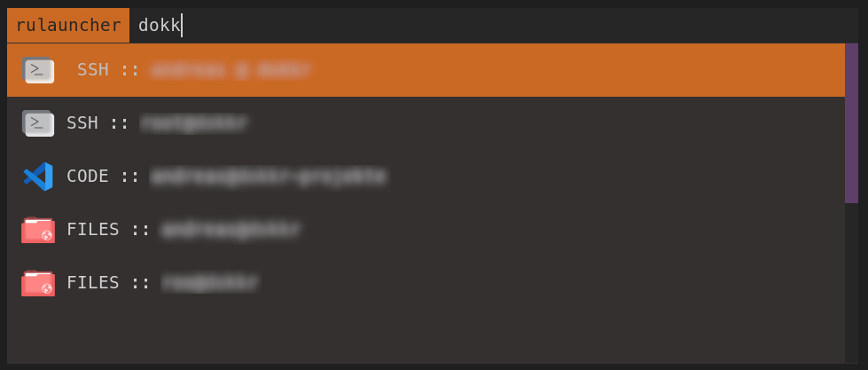

## Rofi Universal Launcher

launches all kind of Programs from a csv file.

For Reference, see "config.example.ini" and "fav.example.txt"

Rename "config.example.ini" to "config.ini".

[icons](https://github.com/vinceliuice/Fluent-icon-theme) are from https://github.com/vinceliuice/Fluent-icon-theme Repo

